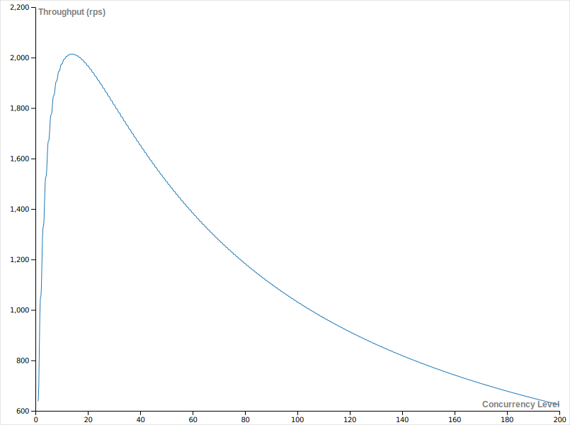

# WA2-TicketSystem

## Group members
- Deda Mario - s292645
- Di Franco Francesco - s284590
- Galliano Giacomo - s292482
- Gulotta Dario Paolo - s292474

## Project Structure
```
WA2-TICKETSYSTEM
.
|__benchmark
|    |__LoadTestResults
|    
|server
   |__src
       |__main
       |    |__kotliln
       |    |   |__...
       |    |      |__csv_creator
       |    |      |__server
       |    |
       |    |__resources
       |     
       |__test
```

## Project structure
### Server endpoints
The server exposes a single endpoint (`/validate`) which accepts exclusively POST requests by the client.

The endpoint will first validate the request body and make sure that both the zone and the token are not null nor not empty. If the check succeeds the request is mapped into a TicketDTO object.

After the validation succeeds, the TicketValidationService is responsible for performing all the various conformity checks such as: JWT signature validation, JWT expiration validation, ticket validity zone checks and ticket uniqueness checks (more on this below).

The JWT validation is performed using the `jjwt` library, which not only checks that signature of the token is valid but it also checks that the token has not expired. The JWT signature/key is stored in the *application.properties* file. This signature is `base64 encoded`, otherwise it will be considered invalid.

An additional JWT expiration check is performed after the above check to make sure that expiration constraint is properly enforced if for some reason the above check fails. To perform such check the expiry time of the JWT is compared with the current system time by converting both in the Milliseconds since Unix Epoch format.  

The ticket validity zone, which makes sure that the zone received in the request body matches the valid zones of the ticket, is case sensitive.

Ticket uniqueness is enforced by querying through Spring JPA a PostreSQL DB. In the DB a Ticket table having only 1 column (TicketID) is used. First a findById query is executed to make sure that the received and decoded TicketID (sub field in the JWT) is unique and if so it is inserted in the DB through a save query. In order to ensure the atomicity of the two queries (since the server is multithreaded) the @Transactional annotation is used on the corresponding Service function. 

### DB connection properties
The PostgreSQL connection details and operation modes are specified in the *application.properties* file. Please make sure that the credentials match those configured in the PostgreSQL Docker container otherwise the connection is refused.

### Why perform 2 separate queries on the db?
While it is true that a save operation will fail if the primary key alredy exists (duplicate PK), by default PostgreSQL will not throw any exception if this situation is presented, since a throwing ON CONFLICT behaviour must be specified. Since this behaviour must be enabled in the PostgreSQL Docker container we decided that it is better to implement a more inclusive solution by performing 2 queries, the first to check if the ticket is unique and then a save is performed.

### How to switch on the additional DB check?
In order to simplify the testing & loadtesting procedures we have implemented the following logic to decide whether the DB check needs to performed or not:
- if the `sub` field of the JWT is empty: NO DB CHECK
- if the `sub` field of the JWT is not empty: DB CHECK IS PERFORMED

### Endpoint reply codes
If the received JWT passes all the validity checks a code 200 (HTTP OK) is returned, otherwise if any check fails a code 403 (HTTP FORBIDDEN) is returned.

All the validity checks (except the request body validation) are performed in the TicketValidationService.

The TicketValidationService will throw an custom and appropriate exception if any of the checks fails. By implementing a ControllerAdvisor we are able to manage such situations by telling the Controller to return a code 403 whenever such exceptions are thrown.


## Test
### Unit tests
Their aim is to test individual modules of the application in isolation to confirm that the code is doing things right.

We've implemented the following Unit Tests:
- `fun rejectInvalidJWT()`: tests the validation module sending an invalid JWT signature
- `fun rejectExpiredJWT()`: tests the validation module sending an expired JWT token
- `fun rejectInvalidValidityZone()`: tests the validation module sending a JWT token with an invalid validity zone
- `fun rejectEmptyValidityZoneToken()`: tests the validation module sending a JWT token with an empty validity zone
- `fun acceptValidJWT()`: tests the validation module sending a valid JWT token without checking on a database
- `fun acceptUniqueTicket()`: tests the validation module sending a valid JWT token. Using a database checks if that `sub` identifier  is unique
- `fun rejectDuplicateTicket()`: tests the validation module sending a pair of equals JWT tokens. After checking on a database, it rejects them if they've the same `sub` identifier
- `fun rejectEmptyPayloadRequest()`: tests the validation module sending a valid JWT signature but with an empty payload
- `fun rejectEmptySubRequest()`: tests the validation module sending a valid JWT signature but with an empty `sub` field.

### Integration tests
Their aim is to check if different modules are working fine when combined together as a group.

We've implemented the following Integration Tests:
- `fun rejectInvalidJWT()`: tests the validation module sending an HTTP post request with an invalid JWT signature
- `fun rejectExpiredJWT()`: tests the validation module sending an HTTP post request with an expired JWT token
- `fun rejectInvalidValidityZone()`: tests the validation module sending an HTTP post request with a JWT token with an invalid validity zone
- `fun rejectEmptyZone()`: tests the validation module sending an HTTP post request with a JWT token with an empty validity zone
- `fun rejectEmptyJWT()`: tests the validation module sending an HTTP post request with an empty token
- `fun rejectEmptyRequest()`: tests the validation module sending an empty HTTP post request
- `fun rejectEmptyPayloadRequest`: tests the validation module sending an HTTP post request with a valid JWT signature but with an empty payload
- `fun rejectEmptSubRequest`: tests the validation module sending an HTTP post request with a valid JWT signature but with an empty `sub`
- `fun acceptValidJWT()`: tests the validation module sending an HTTP post request without checking on a database
- `fun acceptUniqueTicket()`: tests the validation module sending an HTTP post request. Using a database checks if that `sub` identifier is unique
- `fun rejectDuplicateTicket()`: tests the validation module sending a pair of equals HTTP post requests. After checking on a database, it rejects them if they've the same `sub` identifier.

## Loadtest
Loadtest can be run using the `benchmark/RunLoadtest.js` NodeJS module which exports a single no parameter no arguments function. This module relies on the `RandomRequestBodyGenerator.js` module which is responsible to generate request bodies with random fields. By default this module has a probability of 50% to generate valid requests and of 50% to generate invalid requests. The `RunLoadtest.js` module will generate 6 files under the `benchmark/LoadTestResults` folder. These files store a JSON version of the output result object produced by the *Loadtest* library.

### Generating the expected throughput CSV file
In order to generate the CSV file reporting the expected system behavior at increasing concurrency level the `it.polito.wa2.g17.csv_creator/CsvCreator.kt` script must be used. This script will generate a CSV file reporting the expected system behaviour up to a concurrency level of 200. The resulting file is name `expected_throughput.csv`.
The content of the CSV file can be directly pasted in a graphing tool such as [RAWGraphs](https://app.rawgraphs.io/) to generate the graph of the system scalability.

### Changing Loadtest parameters/flags/enable or disable DB checks
In order to change Loadtest parameters/flags the *options* object in `RunLoadtest.js` must be properly modified with the desired parameters (e.g agentKeepAlive, timeout etc).
For switching on/off the DB checks, the *sub* field of the *jwt_payload* object in `RandomRequestBodyGenerator.js` must be modified:
- if NO DB check is needed: *sub* field must be set to and empty string ""
- if DB check is needed: *sub* field must be set to the result of the *randomTicketIdentifier()* function


### Loadtest results - Without DB check

#### Keep-alive = false, timeout = default


___

#### Keep-alive = false, timeout = 100ms

0% of requests timed out. This was expected since the mean latency of the system is just 33ms. 10% increase in throughput.


___

#### Keep-alive = false, timeout = 10ms

45% of requests timed out, 33ms mean latency. A negligible increase in throughput is expected since the timeout is enforced in the client level and not at the server level. The server will continue as normal but if the reply is delayed more than the timeout the client will simply ignore that reply (it will have already terminated its TCP connection with the server). 


___

Keep-alive = true, timeout = default

Considerable increase of 110% in throughput. Expected since the same TCP connections are reused for the different requests instead of creating one for each request. This optimization removes the TCP connection open/closing overheads.



___

### Loadtest results - With DB check

Keep-alive = false, timeout = default

As expected, the projected throughput is lower than the above cases (without DB check) since the server has to perform an additional check. The DB communication is particularly expensive since it needs to communicate with the storage which has low transfer speeds (especially in random reads/writes).


___

Keep-alive = false, timeout = 100ms

20% of packets lost, 70% of packets are erroneous. It is interesting that most of the requests that time out are "correct" requests. This means that most of the delay is caused by the DB because most of the "incorrect" packets never reach the DB check and therefore return an HTTP 403 code much quicker. There is no significant increase in throughput since the timeout most likely occurs while the DB check is in progress so resource contention does not improve.


___

Keep-alive = false, timeout = 50ms

25% of packets lost, 75% of packets are erroneous. It is interesting that most of the requests that time out are "correct" requests. This means that most of the delay is caused by the DB because most of the "incorrect" packets never reach the DB check and therefore return an HTTP 403 code much quicker. There is no significant increase in throughput since the timeout most likely occurs while the DB check is in progress so resource contention does not improve.


___

Keep-alive = false, timeout = 25ms

55% of packets lost, 95% of packets are erroneous. In this case we see also "incorrect" requests timing out since the timeout value is much lower (at 25ms). There is no significant increase in throughput since the timeout most likely occurs while the DB check is in progress so resource contention does not improve.


___

Keep-alive = true, timeout = default

Considerable increase of 35% in throughput. Expected since the same TCP connections are reused for the different requests instead of creating one for each request. This optimization removes the TCP connection open/closing overheads. Even though a boost of 35% in throughput is considerable, due to involvment of the DB in additional checks it still remains much lower the throughput increase observed in the "without DB checks" reported above.


